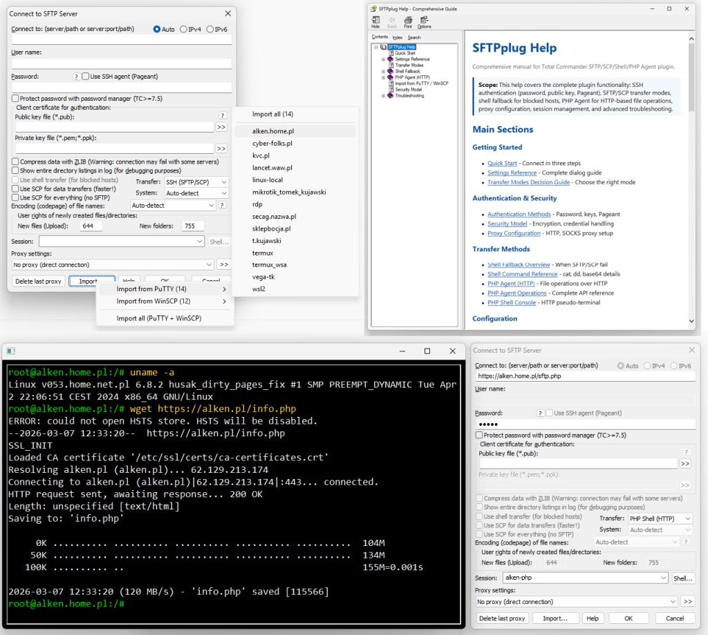
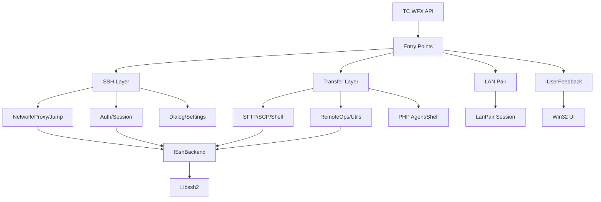
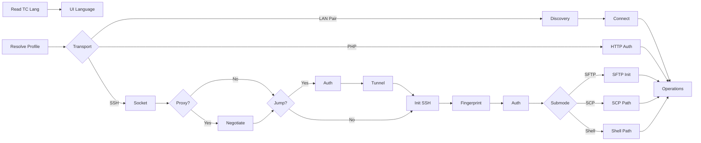
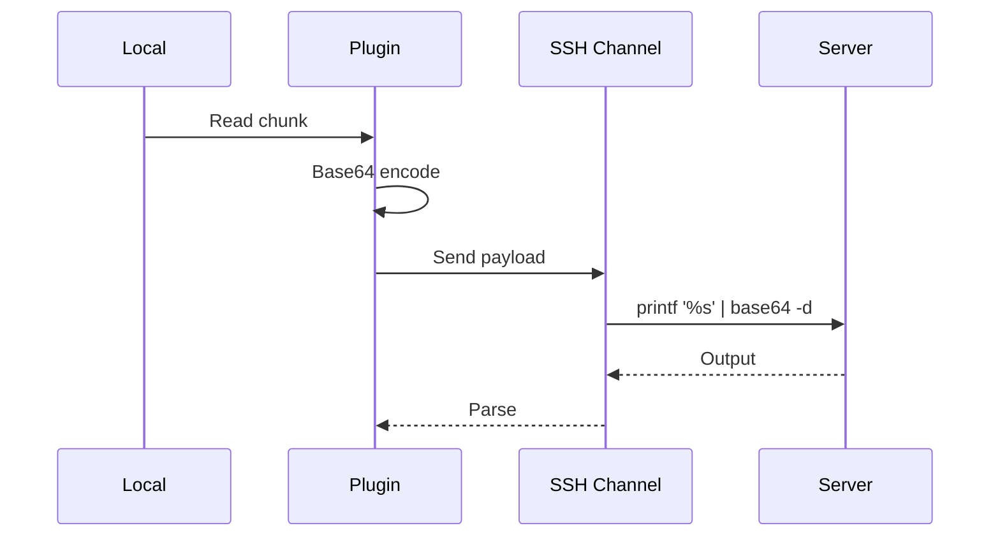
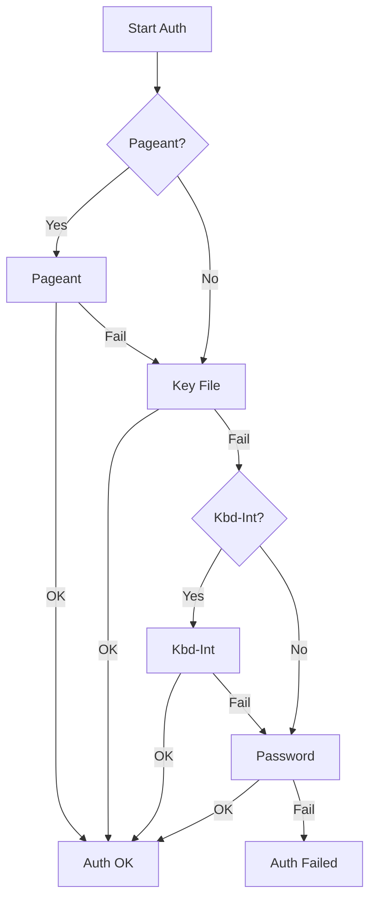
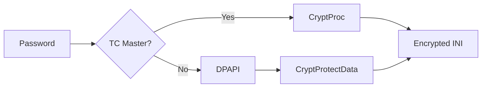

# Secure FTP Plugin for Total Commander

> [!CAUTION]
> **2026-03-13 — Visual C++ Redistributable dependency removed**
>
> Previous builds reported *"Error loading plugin file! The plugin probably needs some DLLs missing"*
> on clean systems without Visual C++ Redistributable installed (`MSVCRT.dll` / `vcruntime140.dll`).
>
> Root cause: `argon2_a.lib` and `libssh2.lib` were compiled with `/MD` (dynamic CRT).
> Fixed: both libraries rebuilt from source with `/MT` — fully static C runtime.
> **The plugin requires no external DLLs or VC++ Redistributable.**



**Version 1.0.0.0** — Modern C++20 SFTP/SCP/PHP/LAN plugin for Total Commander x64 and x86.

Complete C-to-C++ rewrite of the original SFTP plugin by Christian Ghisler. Core transport, authentication, and session modules were re-engineered from scratch with a compatibility-first execution model, interface-driven backend abstraction, and hardened security primitives. The plugin selects the optimal transfer path at runtime — native SFTP, native SCP, shell chunk transfer via `cat`/`dd`/`base64`, PHP Agent over HTTP, or direct LAN Pair — depending on server constraints and deployment topology.

---

## Table of Contents

- [Feature Overview](#feature-overview)
- [Architecture](#architecture)
- [Transfer Protocols](#transfer-protocols)
- [Authentication System](#authentication-system)
- [Security and Password Storage](#security-and-password-storage)
- [Connection Management](#connection-management)
- [LAN Pair Transport](#lan-pair-transport)
- [PHP Agent and PHP Shell](#php-agent-and-php-shell)
  - [Command History](#command-history)
- [Remote File Operations](#remote-file-operations)
- [Shell Engineering Details](#shell-engineering-details)
- [Module Map](#module-map)
- [Source Tree](#source-tree)
- [Build System](#build-system)
- [System Requirements](#system-requirements)
- [Packaging and Installation](#packaging-and-installation)
- [PHP Agent Deployment](#php-agent-deployment)
- [Localization](#localization)
- [Recent Fixes (v1.0.0.0)](#recent-fixes-v1000)
- [Roadmap](#roadmap)

---

## Feature Overview

### Transfer Protocols

| Protocol | Description |
|----------|-------------|
| **SFTP** | Primary transport. Full subsystem support, streaming transfers, resume on interrupted downloads and uploads. |
| **SCP (native)** | Faster than SFTP on many servers. Includes >2 GB file detection via 64-bit server check. |
| **Shell Fallback** | `cat` / `dd` / `base64` chunk pipeline for servers blocking SFTP subsystem and `scp`. Operates over a hidden interactive SSH channel. |
| **Jump Host (ProxyJump)** | Bastion-routed SSH via `direct-tcpip` tunneling. No external `ssh.exe` required. |
| **PHP Agent (HTTP)** | Standalone HTTP transfer mode backed by a single `sftp.php` file. Supports hosts with no SSH account or blocked subsystem. |
| **PHP Shell (HTTP)** | Pseudo-terminal over HTTP via `SHELL_EXEC` in `sftp.php`. Persistent command history (Up/Down arrows, 128-entry ring buffer) stored in `%APPDATA%\GHISLER\shell_history.txt`. Maintains working-directory context across requests. |
| **LAN Pair** | Direct Windows-to-Windows pairing mode. Custom PAIR1 authentication protocol, LAN2 file-transfer command protocol, UDP broadcast peer discovery. |

### Authentication Methods

| Method | Notes |
|--------|-------|
| **Password** | Standard password auth. |
| **Keyboard-Interactive** | Includes automated password-change-request handling. |
| **PEM / OpenSSH** | Traditional private key formats, passed directly to libssh2. |
| **PPK v2 / v3 (native)** | Built-in PuTTY key file parser. No external tools. BCrypt + Argon2d/i/id + AES-256-CBC. |
| **Pageant** | SSH Agent integration. Auto-launch from `pageant.lnk` in the plugin directory. |
| **Fallback chain** | Automatic progression: Pageant → key file → keyboard-interactive → password. |

### Security Primitives

- Windows DPAPI (`CryptProtectData`) for password storage at the Windows account level.
- TC Master Password integration via `CryptProc` API with `!` sentinel.
- `SecureZeroMemory` on all sensitive buffers after use.
- PBKDF2-HMAC-SHA256 (120,000 iterations) and HMAC-SHA-256 challenge-response in LAN Pair auth.
- DPAPI-protected LAN Pair trust keys stored persistently per peer pair.
- `DllExceptionBarrier` — C++ exception firewall at every exported entry point; prevents any exception from crossing the ABI boundary into Total Commander (which would cause an immediate host crash).
- Legacy XOR passwords: read-only backward compatibility, never written for new profiles.

### Additional Capabilities

- Session import from PuTTY and WinSCP Windows Registry.
- Proxy support: HTTP CONNECT, SOCKS4, SOCKS4a, SOCKS5 (with or without credentials).
- Dual-stack IPv4/IPv6 (`getaddrinfo`, `AF_INET6`).
- Host key fingerprint verification with first-connection warning and change alert.
- Remote checksum calculation without downloading: MD5, SHA1, SHA256, SHA512.
- Automatic UTF-8 filename detection via remote `locale` command.
- Automatic CRLF/LF conversion on text-mode transfers.
- Symlink tracking including `~` home directory shortcut protection.
- Multi-language UI embedded in a single binary: English, Polish, German, French, Spanish, Italian.
- Dual-architecture distribution: x64 (`SFTPplug.wfx64`) and x86 (`SFTPplug.wfx`) in a single ZIP.
- Built-in CHM help (`sftpplug.chm`) opened from the plugin dialog Help button.
- Background transfer support (TC `BG_DOWNLOAD` / `BG_UPLOAD` flags).

---

## Architecture

### Layered Structure



```
WFX API Layer
  ↓
DllExceptionBarrier (every exported Fs* function)
  ↓
Plugin Entry Points (FsFindFirst / FsGetFile / FsPutFile / FsExecuteFile / ...)
  ↓
┌───────────────────────────────────────────┐
│  Business Logic Layer                     │
│  ├─ ConnectionNetwork / ProxyNegotiator   │
│  ├─ ConnectionAuth / SessionPostAuth      │
│  ├─ SFTP / SCP / Shell fallback           │
│  ├─ PHP Agent (HTTP) / PHP Shell          │
│  └─ UI separation (IUserFeedback)         │
└───────────────────────────────────────────┘
  ↓
ISshBackend Interface (ISshSession / ISshChannel / ISftpHandle)
  ↓
Libssh2Backend Implementation (libssh2 statically linked)
```

### ABI Exception Barrier

Total Commander is not built with the same compiler or exception-handling model as the plugin. Any C++ exception escaping an exported `Fs*` function crosses the ABI boundary and crashes the host process immediately.

`DllExceptionBarrier` (`DllExceptionBarrier.cpp`) is an RAII firewall applied at **every** exported entry point:

```cpp
int WINAPI FsGetFileW(LPCWSTR RemoteName, LPWSTR LocalName, ...) {
    sftp::DllExceptionBarrier barrier;
    return sftp::dll_invoke(barrier, FS_FILE_READERROR, [&]() -> int {
        // implementation — may throw freely
    });
}
```

When an exception is caught, the barrier:

1. Captures the call stack immediately via `CaptureStackBackTrace` + `SymFromAddr` / `SymGetLineFromAddr64` (Windows DbgHelp; SRWLOCK-serialised; lazy-initialized — zero overhead when no exception occurs).
2. Stores the live exception as `std::exception_ptr` (type preserved without RTTI; project builds with `/GR-`).
3. Re-throws locally to classify and extract `what()` text across `std::system_error` / `std::bad_alloc` / `std::exception` hierarchy.
4. Logs diagnostic + stack trace via `SFTP_LOG`.
5. Shows a `MessageBoxW` to the user (once per incident) with the full exception message and call stack.

Symbol names and file:line numbers resolve when the PDB sits next to `sftpplug.wfx`. Both Debug and Release configurations emit PDBs. Without a PDB, hex addresses are printed — still sufficient to identify the failing `Fs*` call chain.

`ShutdownSymbols()` is called from `DllMain DLL_PROCESS_DETACH` to release DbgHelp resources correctly, allowing re-initialization if TC reloads the DLL within the same process.

### ISshBackend Interface

All libssh2 calls are routed through pure-virtual interfaces: `ISshSession`, `ISshChannel`, `ISftpHandle`, `ISftpSession`, `ISshAgent`. This fully decouples business logic from the underlying SSH library.

```cpp
// ISftpHandle — wraps LIBSSH2_SFTP_HANDLE*
struct ISftpHandle {
    virtual ssize_t read(char* buf, size_t len) = 0;
    virtual ssize_t write(const char* buf, size_t len) = 0;
    virtual int readdir(char* buf, size_t blen,
                        char* longentry, size_t llen,
                        LIBSSH2_SFTP_ATTRIBUTES* attrs) = 0;
    virtual int fstat(LIBSSH2_SFTP_ATTRIBUTES* attrs, int setstat) = 0;
    virtual void seek(size_t offset) = 0;
    // ...
};
```

Consequences:
- Future backend migration (e.g., libssh) requires no changes to transfer or auth logic.
- Mock implementations allow unit-testing transfer paths without a real server.

### RAII and Memory Safety

- `std::unique_ptr<ISshSession>`, `std::unique_ptr<ISftpHandle>` throughout.
- `handle_util::AutoHandle<HANDLE>` for Windows file handles.
- `DataBlob` RAII wrapper for `CryptProtectData` / `CryptUnprotectData` output, calling `SecureZeroMemory` then `LocalFree` in destructor.
- `ConnectionGuard` RAII in `PluginEntryPoints.cpp` — ensures new connections are always closed and removed from the registry on any error path in `FsFindFirstW`, preventing resource leaks even when exceptions or early returns occur.
- No manual `new` / `delete` in any module written after the rewrite.

### IUserFeedback Pattern

`WindowsUserFeedback` implements a `IUserFeedback` interface that separates all `MessageBox` / progress-window calls from connection and transfer logic. This prevents UI calls on non-UI threads and makes background transfer mode stable.

### C++20 Feature Usage

| Feature | Used in |
|---------|---------|
| `std::span<const uint8_t>` | LanPair HMAC/PBKDF2, ShellFallbackTransfer |
| `std::string_view` | CoreUtils, LanPair, ProxyNegotiator, UnicodeHelpers |
| `std::optional<T>` | PasswordCrypto, LanPair, PpkConverter |
| `std::format` | PhpAgentClient |
| `constexpr` throughout | All modules |
| `noexcept` | LanPairSession public API, DllExceptionBarrier |
| `std::filesystem` | LanPair, build utilities |
| `std::thread`, `std::mutex`, `std::atomic` | LanPair discovery service |
| Designated initializers | Config structs |
| `int8_t` for tri-state flags | SftpTransfer autodetect |

---

## Connection Lifecycle



Operational constraints enforced in every network loop:
- No unbounded EAGAIN spin.
- Per-phase timeout for connect, auth, and read.
- Deterministic cleanup on every failure path.

---

## Transfer Protocols

### SFTP (Primary)

Full SFTP subsystem support via libssh2. Streaming reads and writes with configurable chunk sizes. Transfer resume implemented correctly: uses `LIBSSH2_SFTP_ATTR_SIZE` flag in `fstat` to determine the actual remote file size before seeking — fixing a regression where resumes always restarted from offset 0.

### SCP (Native)

Dedicated `ScpTransfer.cpp` engine. Handles the SCP wire protocol without the SFTP subsystem. Faster than SFTP on many servers due to lower protocol overhead.

**>2 GB file support:**

| Step | Implementation |
|------|---------------|
| Server architecture check | Remote `file $(which scp)` to detect 64-bit binary |
| Transfer mode | Automatic adjustment for large files |
| Fallback | Shell transfer if SCP limit is detected at runtime |

Requires libssh2 ≥ 1.7.0 for 64-bit size field support.

### Shell Fallback (DD / Base64)

For servers where the SFTP subsystem is blocked and `scp` is unavailable. Uses a hidden interactive SSH shell channel.



**Upload:** Split data into 1024-byte chunks → base64-encode → send via `printf '%s' | base64 -d` → server appends decoded bytes.

**Download:** Fast path via `cat`. Fallback to `base64 -w 0` when binary pipe is unreliable. Incremental decode (streaming, no full-file buffering).

Chunk size kept below 1024 bytes (1368 base64 characters) to stay within shell line-length limits on restricted hosts.

Base64 encoder is self-contained (`ShellB64Encode` / `ShellB64Decode` in `ShellFallbackTransfer.cpp`), with no external dependency.

### Jump Host (ProxyJump)

Handled in `JumpHostConnection.cpp`. Connects and authenticates to the bastion host, then opens a `direct-tcpip` channel to the final target. The full auth sequence (including PPK, Pageant, keyboard-interactive) runs on the jump host before the tunnel is established. No external `ssh.exe` binary involved.

### Remote Checksums

File integrity verification directly on the server:

| Algorithm | Shell commands tried |
|-----------|---------------------|
| MD5 | `md5sum` / `md5 -q` |
| SHA1 | `sha1sum` / `sha1 -q` |
| SHA256 | `sha256sum` / `shasum -a 256` |
| SHA512 | `sha512sum` / `shasum -a 512` |

---

## Authentication System

### Method Selection and Fallback



Fail-fast local validation before any network auth attempt:

| Condition | Behavior |
|-----------|----------|
| `privkeyfile` not set | Immediate local error — no fallback stall |
| Explicit `pubkeyfile` missing from disk | Immediate local error |
| Invalid PPK format | Precise error with MAC/KDF diagnostics |

This eliminates the minute-long UI freeze caused by impossible auth attempts in the original plugin.

### Native PPK v2 / v3 Decoder

Implemented in `PpkConverter.cpp`. Converts PuTTY Private Key files to traditional PEM format for libssh2 — no external tools, no `puttygen.exe`.

**PPK v3 specification coverage:**

| Component | Implementation |
|-----------|---------------|
| KDF | Argon2d / Argon2i / Argon2id — statically linked (argon2, /MT) |
| Encryption | AES-256-CBC |
| MAC | HMAC-SHA-256 over `(algorithm ‖ encryption ‖ comment ‖ public_blob ‖ private_blob_plain)` |
| MAC key source | Argon2 output bytes 48–79 (encrypted keys); empty string (unencrypted keys) |
| Key derivation | Windows BCrypt `BCRYPT_SHA256_ALGORITHM` with HMAC flag |
| Output | Traditional PEM, passed to `libssh2_userauth_publickey_frommemory` |

**PPK v2** uses SHA-1-based key derivation, also fully handled natively.

SSH wire format helpers (`AppendU32`, `AppendSshStr`, `ReadSshStr`) are implemented inline without any external parser library.

### Pageant Integration

Connects via named pipe to the running Pageant agent. If Pageant is not running and `pageant.lnk` exists in the plugin directory, the plugin launches it automatically before retrying agent auth.

---

## Security and Password Storage

### Storage Modes



| Mode | INI format | Description |
|------|-----------|-------------|
| TC Master Password | `password=!` | Delegated to TC `CryptProc` API |
| DPAPI | `password=dpapi:<base64>` | `CryptProtectData`, user-account scope |
| Explicit plaintext | `password=plain:<text>` | Opt-in only |
| Legacy XOR | `<decimal triplets>` | Read-only; written in 2000s versions |

### DPAPI Implementation

`DataBlob` RAII class in `PasswordCrypto.cpp`:

```cpp
class DataBlob {
    ~DataBlob() {
        if (blob_.pbData) {
            SecureZeroMemory(blob_.pbData, blob_.cbData);
            LocalFree(blob_.pbData);
        }
    }
    bool encrypt(const std::string& plain);       // CryptProtectData
    std::optional<std::string> decrypt() const;   // CryptUnprotectData
};
```

After decryption, the plaintext buffer is `SecureZeroMemory`-zeroed before `LocalFree`. Base64 encoding/decoding uses Windows `CryptBinaryToStringA` / `CryptStringToBinaryA`.

### ABI Boundary Protection

`DllExceptionBarrier` guards all exported `Fs*` functions. Any C++ exception — including `std::bad_alloc`, `std::system_error`, or third-party exceptions — is caught before it reaches Total Commander's call frame. The diagnostic (exception type, `what()` text, and resolved call stack) is logged and shown to the user in a `MessageBoxW`. TC continues running. See [ABI Exception Barrier](#abi-exception-barrier) in the Architecture section.

### Legacy XOR

The XOR key is hardcoded because:
1. XOR is obfuscation, not encryption — moving it would not improve security.
2. It is never used for writing new passwords.
3. Backward compatibility requires the same key to remain stable indefinitely.

Documented explicitly in source to prevent well-meaning refactors that would break existing user profiles.

---

## Connection Management

### Proxy Support

| Type | Auth |
|------|------|
| HTTP CONNECT | Basic (username:password) |
| SOCKS4 | None |
| SOCKS4a | None |
| SOCKS5 | None / username-password |

Implemented in `ProxyNegotiator.cpp`, isolated from the main connection path.

### Session Import

`SessionImport.cpp` reads from Windows Registry:

| Source | Registry path |
|--------|--------------|
| PuTTY | `HKCU\Software\SimonTatham\PuTTY\Sessions` |
| WinSCP | `HKCU\Software\Martin Prikryl\WinSCP 2\Sessions` |

Conversion rules:
- Non-conflicting merge into plugin INI — existing entries are not overwritten.
- Host, port, username, and key paths are preserved.
- No auto-connect side effects during import.

### Host Key Verification

MD5 fingerprint stored in INI per server. First connection prompts acceptance. Changed key raises an explicit warning dialog. Both behaviors use the `IUserFeedback` interface so they work correctly in background transfer mode.

---

## LAN Pair Transport

Direct Windows-to-Windows file transfer without SSH. Uses a custom application-layer protocol stack over TCP/UDP on the local network.

### Discovery (UDP Broadcast)

`DiscoveryService` (in `LanPair.cpp`) runs a background thread broadcasting peer announcements and collecting incoming ones.

| Parameter | Default |
|-----------|---------|
| UDP broadcast port | 45845 |
| TCP pairing port | 45846 |
| Broadcast interval | 1500 ms |
| App tag | `KVCPAIR/1` |

`PeerAnnouncement` fields: `peerId`, `hostName`, `displayName`, `ip`, `tcpPort`, `role` (`Donor` / `Receiver` / `Dual`), `lastSeen`.

### PAIR1 Authentication Protocol

Challenge-response over the TCP socket established after discovery. Wire exchange:

```
Client → Server:  PAIR1 HELLO <peerId> <role> <clientNonceHex>
Server → Client:  PAIR1 CHALLENGE <serverNonceHex> <saltHex> <serverPeerId> <displayName> <role> <port>
Client → Server:  PAIR1 AUTH <proofHex>
Server → Client:  PAIR1 OK <serverProofHex>
             or:  PAIR1 OKTRUST <serverProofHex> <issuedTrustHex>
```

Key derivation for auth proof:

```
key    = PBKDF2-HMAC-SHA256(password, salt, 120 000 iterations, 32 bytes)
proof  = HMAC-SHA256(key, clientNonce ‖ serverNonce ‖ "client")
```

Both client and server verify each other's proof. On first successful connection with password, the server issues a trust token (`OKTRUST`). On subsequent connections, the stored DPAPI trust key is used instead of the password — TOFU (Trust On First Use) model.

### DPAPI Trust Key Storage

`DpapiSecretStore` in `LanPair.h` persists trust keys in DPAPI-protected storage keyed by `"lanpair_trust_srv_<serverPeerId>__<clientPeerId>"`. Trust is per peer-pair, per Windows user account.

### LAN2 Command Protocol

After PAIR1, the authenticated TCP socket runs the LAN2 line-based command protocol for file operations:

```
Frame header: magic=0x4B564350 ("KVCP"), version=1, PairCommandType, reserved, payloadSize
```

`PairCommandType` values: `Handshake`, `ListRoots`, `ListDirectory`, `StartSend`, `StartReceive`, `DataChunk`, `Ack`, `Error`.

`LanPairSession` public API:

```cpp
static std::unique_ptr<LanPairSession> connect(...) noexcept;
bool listRoots(std::vector<std::string>& roots) noexcept;
bool listDirectory(const std::string& path, std::vector<DirEntry>& entries) noexcept;
bool getFile(const std::string& remotePath, LPCWSTR localPath, ...) noexcept;
bool putFile(LPCWSTR localPath, const std::string& remotePath, ...) noexcept;
bool mkdir(const std::string& path) noexcept;
bool remove(const std::string& path) noexcept;
bool rename(const std::string& oldPath, const std::string& newPath) noexcept;
void setTimeoutMin(int minutes) noexcept;
```

Session timeout configurable via `setTimeoutMin(int minutes)`. When a non-zero timeout is set, every `cmd()` call checks elapsed time via `std::chrono::steady_clock` and closes the session automatically when the limit is reached. All methods are `noexcept`.

---

## PHP Agent and PHP Shell

### PHP Agent (HTTP)

Single-file `sftp.php` deployed on the web server. The plugin communicates via WinHTTP (`winhttp.lib`), sending chunked `multipart/form-data` for uploads and receiving raw bytes for downloads.

Operations supported: `PROBE`, `LIST`, `GET`, `PUT`, `MKDIR`, `REMOVE`, `RENAME`, `CHMOD`, `STAT`.

`AgentUrl` struct parsed from connection profile: `secure` (HTTPS), `host`, `port`, `object` path.

### PHP Shell (HTTP)

Uses the same `sftp.php` endpoint but routes commands through `SHELL_EXEC`. Maintains working-directory awareness across requests. Provides a pseudo-terminal experience for operational tasks on hosts with no SSH access.

#### Command History

The shell console maintains a **persistent** command history that survives session restarts and plugin reloads.

**Navigation**

| Key | Action |
|-----|--------|
| `↑` Up arrow | Recall previous command |
| `↓` Down arrow | Move forward through history (↓ after reaching the end clears the input line) |

**Storage location**

```
%APPDATA%\GHISLER\shell_history.txt
```

This is the same directory Total Commander uses for its own configuration, keeping all related data in one place. The file is a plain UTF-8 text file, one command per line, and can be opened or inspected in any text editor.

**Capacity — ring buffer**

The file holds a maximum of **128 entries**. When the 129th command is added, the oldest entry is dropped from the top. The file is always rewritten in full on every addition — at 128 short lines this is a negligible I/O cost and eliminates any possibility of stale data from a partial write.

**Duplicate suppression**

Consecutive identical commands are not added to history (equivalent to bash `HISTCONTROL=ignoredups`). Running the same command twice in a row records it only once.

**Clearing history**

History can be cleared from inside the shell console without leaving it:

```bash
history -c
```

or equivalently:

```bash
clear history
```

Both commands erase all entries from memory **and** delete `shell_history.txt` from disk immediately. The cursor resets to an empty state. This is equivalent to `history -c` in bash and is the recommended way to clear sensitive command traces (e.g. after typing a password inline).

> **Note:** `exit` and `logout` close the console window but do **not** clear history — existing entries are preserved for the next session.

**Power-loss and crash safety**

Each write uses an atomic two-step pattern:

1. The new content is written to a temporary file (`shell_history.txt.tmp`) in the same directory.
2. `MoveFileExA` with `MOVEFILE_REPLACE_EXISTING` renames the temp file over the real file.

On NTFS, a rename within the same volume is a single metadata operation. If power is lost or the process is killed between steps 1 and 2, the previous `shell_history.txt` remains intact — it is never truncated or partially overwritten. The worst-case outcome is a leftover `.tmp` file containing the most recent history, which can be renamed manually if needed.

### PHP Agent Deployment

> **Critical:** The `sftp.php` in the release package ships with **no password configured**. Uploading it before saving a session in the plugin will result in HTTP 503 on every connection attempt. Always follow the order below.

**Step 1 — Configure and save the session in Total Commander**

Open the plugin connection dialog (Net → Connect). Fill in:

| Field | Value |
|-------|-------|
| **Connect to** | Full URL to `sftp.php` on your server, e.g. `https://example.com/sftp.php` |
| **Transfer mode** | `PHP Agent (HTTP)` (or `PHP Shell (HTTP)`) |
| **Password** | Your chosen shared secret |
| **Session name** | Any label, e.g. `My Hosting` |

Click **Save**. The plugin writes a salted SHA-256 hash (`AGENT_PSK_SALT` + `AGENT_PSK_SHA256`) into its local copy of `sftp.php`. The password itself is never stored in the file.

**Step 2 — Upload the modified `sftp.php`**

Copy the local file (containing your hash) to the server:

```
...\Total Commander\plugins\wfx\SFTPplug\sftp.php  →  https://example.com/sftp.php
```

Use FTP, cPanel File Manager, or any other method. Do **not** upload the original from the download package — it has empty PSK fields.

**Step 3 — Verify the endpoint**

Open `https://example.com/sftp.php?op=PROBE` in a browser:

| Response | Meaning |
|----------|---------|
| HTTP 200 `{"status":"ok"}` | Ready — proceed to connect |
| HTTP 401 Unauthorized | Script running, awaiting auth — also OK |
| HTTP 503 Service Unavailable | PSK not configured — wrong file uploaded; repeat from Step 1 |
| HTTP 404 Not Found | Wrong URL or file not yet uploaded |

**Step 4 — Connect**

Select the saved session in Total Commander and connect.

**Security model**

| Location | Stored | Password exposed? |
|----------|--------|-------------------|
| `sftpplug.ini` (your PC) | Password encrypted with Windows DPAPI | No |
| `sftp.php` (server) | `AGENT_PSK_SALT` + SHA-256(salt + password) | No — one-way hash |
| Network (HTTPS) | HMAC-SHA256 signature + timestamp + nonce per request | No — signature only |

Even if someone reads `sftp.php` on the server, the original password cannot be recovered.

---

## Remote File Operations

All operations are available over SFTP, SCP, and PHP Agent modes (where applicable).

| Operation | SFTP | SCP/Shell | PHP Agent |
|-----------|------|-----------|-----------|
| Directory listing | Native SFTP readdir | `ls -la` + `__WFX_LIST_BEGIN__` / `__WFX_LIST_END__` markers | Agent `LIST` command |
| Download | Native, with resume | Shell / `cat` | Agent `GET` |
| Upload | Native, with resume | Shell / `dd` / base64 | Agent `PUT` |
| Rename / Move | SFTP `rename` | Remote `mv` | Agent `RENAME` |
| Delete file/tree | SFTP `unlink` / recursive | Remote `rm -rf` | Agent `REMOVE` |
| Create directory | SFTP `mkdir` | Remote `mkdir` | Agent `MKDIR` |
| Chmod | SFTP `setstat` | Remote `chmod` | Agent `CHMOD` |
| Set attributes (`FsSetAttrW`) | SFTP lstat → RMW write bits → setstat | — | — |
| Timestamps | SFTP `setstat` | Remote `touch` | — |
| Symlink resolution | SFTP `realpath` | Parsed from `ls -la` output | — |
| Remote checksum | Shell command | Shell command | — |
| File properties | SFTP `stat` | Shell `stat` | Agent `STAT` |

### Symlink and Tilde Handling

Symlinks are parsed from `ls -la` long-entry format and followed recursively. Special protection against downloading the literal string `~` as a file: the plugin detects this case, reconnects, and retries with the resolved home path.

---

## Shell Engineering Details

### Marker-Aware Directory Listing (SCP Mode)

Real SSH servers vary in shell behavior (prompts, echo, MOTD). The plugin injects unique markers to delimit directory output reliably:

| Marker | Purpose |
|--------|---------|
| `__WFX_LIST_BEGIN__` | Start of `ls -la` output |
| `__WFX_LIST_END__` | End of `ls -la` output |
| `echo $?` | Exit code detection after command |

Defensive buffer filtering discards echoed commands, prompts, and MOTD lines before parsing.

### Restricted Server Handling

| Scenario | Mitigation |
|----------|-----------|
| SFTP subsystem blocked | Fall through to SCP, then shell fallback |
| `scp` not available | Shell chunk transfer via `cat` / `dd` / base64 |
| Noisy shell prompts | Buffer filtering with marker anchoring |
| Delayed output (slow server) | Staggered read timeouts per stage |
| No 64-bit `scp` (>2 GB) | Automatic detection, fallback to shell transfer |

### UTF-8 Detection

Remote `locale` command output is parsed to determine the server's character encoding. If UTF-8 is detected, filename conversion uses the Unicode helpers in `UnicodeHelpers.cpp` / `UtfConversion.cpp`. Otherwise, system code page conversion is applied.

---

## Module Map

| Module | Responsibility | Notes |
|--------|---------------|-------|
| `PluginEntryPoints.cpp` | TC WFX API entry points (`FsFindFirst`, `FsGetFile`, `FsPutFile`, `FsExecuteFile`, ...) | Legacy C ABI surface; `ConnectionGuard` RAII |
| `DllExceptionBarrier.cpp` | C++ exception firewall at ABI boundary; DbgHelp stack trace | Every `Fs*` wrapped via `dll_invoke` |
| `ConnectionNetwork.cpp` | Socket creation, IPv4/IPv6 resolution, raw connect | Isolated network stage |
| `ProxyNegotiator.cpp` | HTTP CONNECT, SOCKS4/4a/5 negotiation | Dedicated proxy module |
| `JumpHostConnection.cpp` | Bastion host auth + `direct-tcpip` tunnel | No external `ssh.exe` |
| `SshSessionInit.cpp` | SSH session bootstrap (handshake, banner) | Modular session init |
| `ConnectionAuth.cpp` | Auth method dispatch | Triggers fallback chain |
| `SessionPostAuth.cpp` | Post-auth session steps (shell, SFTP init) | Separated from auth |
| `ConnectionDialog.cpp` | Connection dialog and UI handlers | `UpdateCertSectionState` consolidates cert section enable/disable for all transport modes |
| `ConnectionDialogClass.cpp` | Dialog class and submode handling | |
| `SftpAuth.cpp` | Auth helpers, key-mode selection | Native PPK-aware |
| `SftpConnection.cpp` | High-level connection orchestration | Split from legacy monolith |
| `SftpTransfer.cpp` | Native SFTP transfer path, resume | Streaming buffers; ATTR_SIZE fix |
| `ScpTransfer.cpp` | Native SCP transfer path | Dedicated SCP engine |
| `ShellFallbackTransfer.cpp` | `cat`/`dd`/base64 chunk pipeline | Compatibility-first fallback |
| `SftpRemoteOps.cpp` | Listing, remote file operations | Marker-aware parsing; `SftpSetAttr` |
| `SftpShell.cpp` | Shell channel execution, EAGAIN guards | |
| `TransferUtils.cpp` | Progress, rate, shared transfer helpers | |
| `PhpAgentClient.cpp` | PHP Agent HTTP operations (WinHTTP) | |
| `PhpShellConsole.cpp` | PHP Shell pseudo-terminal; keyboard input, Tab completion, Up/Down history navigation | |
| `ShellHistory.cpp` | Persistent command history — ring buffer (128 entries), atomic NTFS write, `%APPDATA%\GHISLER\shell_history.txt` | `ShellHistory.h` |
| `PpkConverter.cpp` | PPK v2/v3 → PEM conversion | BCrypt + Argon2; no tools |
| `PasswordCrypto.cpp` | DPAPI encrypt/decrypt, legacy XOR read | `DataBlob` RAII |
| `SessionImport.cpp` | PuTTY / WinSCP registry → INI | Non-destructive merge |
| `ServerRegistry.cpp` | In-memory server profile registry | |
| `ProfileSettings.cpp` | INI read/write for connection profiles | |
| `LanPair.cpp` | PAIR1 auth protocol, UDP discovery, PBKDF2 | `namespace smb` |
| `LanPairSession.cpp` | LAN2 command protocol, file transfer session | `noexcept` public API; session timeout enforcement |
| `Libssh2Backend.cpp` | `ISshBackend` implementation over libssh2 | |
| `AuthMethodParser.cpp` | Parses server-advertised auth method list | |
| `FtpDirectoryParser.cpp` | `ls -la` output parser | Unicode-aware |
| `CoreUtils.cpp` | Base64, time conversion, string utilities | Self-contained |
| `UnicodeHelpers.cpp` / `UtfConversion.cpp` | UTF-8 ↔ wide string conversion | |
| `WindowsUserFeedback.cpp` | `IUserFeedback` implementation | Decouples UI from logic |
| `PluginHelp.cpp` | Opens `sftpplug.chm` from plugin directory | |

---

## Source Tree

```
build.ps1                      # PowerShell build script (multi-language or single-language; x64 + x86)
bin/
  SFTPplug.zip                 # Release archive (TC auto-install) — only file produced here
build/
  SFTPplug.vcxproj             # MSVC project (C++20 / C17, x64 Release + x86 Release)
  SFTPplug.sln
  SFTPplug.vsprops
src/
  agent/
    sftp.php                   # PHP Agent (maintained source)
    sftp_php74.php             # PHP 7.4 compatibility variant
  core/
    *.cpp                      # All plugin modules (see Module Map)
    ShellHistory.cpp           # Persistent command history manager
  help/
    index.html
    authentication.html
    jump-host.html
    lan-pair.html
    php-agent.html
    php-agent-operations.html
    php-shell.html
    proxy-configuration.html
    sessions.html
    shell-commands.html
    shell-fallback.html
    transfer-modes.html
    security.html
    troubleshooting.html
    troubleshooting-advanced.html
    settings-reference.html
    encoding.html
    quickstart.html
    import-migration.html
    sftpplug.hhp               # HTML Help Workshop project
    sftpplug.hhc               # Table of contents
    sftpplug.hhk               # Index
    readme.txt                 # readme.txt distributed inside SFTPplug.zip
  include/
    global.h                   # Master header, debug config, C++20 guards
    ISshBackend.h              # Pure-virtual SSH backend interface
    SftpInternal.h             # Connection state structs
    DllExceptionBarrier.h      # ABI exception firewall
    ShellHistory.h             # Persistent command history interface
    CoreUtils.h
    LanPair.h                  # smb:: namespace, PAIR1/LAN2 types
    LanPairSession.h
    *.h
    libssh2/
      libssh2.h
      libssh2_sftp.h
      libssh2_publickey.h
  lib/
    argon2_a_x64.lib           # Argon2 static lib — x64, /MT (rebuilt from source)
    argon2_a_x86.lib           # Argon2 static lib — x86, /MT (rebuilt from source)
    libssh2_x64.lib            # libssh2 static lib — x64, WinCNG, /MT (rebuilt from source)
    libssh2_x86.lib            # libssh2 static lib — x86, WinCNG, /MT (rebuilt from source)
  res/
    sftpplug.rc                # String tables: EN / PL / DE / FR / ES
    resource.h
    icon*.ico
third_party/
  build.ps1                    # Builds all dependency libs (argon2 + libssh2, x64 + x86, /MT)
  argon/
    vs2026/
      Argon2Static/
        Argon2Static.vcxproj   # MSVC project: argon2_a_x64.lib / argon2_a_x86.lib, /MT
    build/
      x64/argon2_a_x64.lib    # (build artifact — excluded from git)
      x86/argon2_a_x86.lib    # (build artifact — excluded from git)
  libssh2/
    ...                        # libssh2 source (excluded from git via .gitignore)
    bld_x64/                   # (build artifact — excluded from git)
    bld_x86/                   # (build artifact — excluded from git)
```

---

## Build System

`build.ps1` (project root) compiles the plugin using MSBuild with the MSVC v145 toolset. Both x64 and x86 targets are built by default and packaged together in a single ZIP.

**Default (all languages in one binary, x64 + x86):**

```powershell
.\build.ps1
```

**Single-language builds (smaller binary):**

```powershell
.\build.ps1 -en   # English
.\build.ps1 -pl   # Polish
.\build.ps1 -de   # German
.\build.ps1 -fr   # French
.\build.ps1 -es   # Spanish
```

Single-language mode strips unused RC language blocks before compile and restores them afterward. Both x64 and x86 are still built.

**Output after a successful build:**
- `bin\SFTPplug.zip` — only file remaining in `bin\`; auto-deployed to TC plugin directory
- ZIP contains both `SFTPplug.wfx64` (x64) and `SFTPplug.wfx` (x86)
- ZIP file timestamp is set to `2030-01-01 00:00:00` (dependency-free release marker)
- Intermediate files (`build\bin\`, `build\.intermediates\`) are fully removed

**Release configuration:**
- Standard: `stdcpp20` (C++20), `stdc17` (C17)
- Optimization: `MaxSpeed`
- Runtime library: `MultiThreaded` (`/MT`, static CRT — no VC++ Redistributable required)
- Whole program optimization: enabled
- `NDEBUG` defined → `SFTP_DEBUG_ENABLED=0`, `SFTP_DEBUG_TO_FILE=0`

**Debug configuration:**
- `SFTP_DEBUG_ENABLED=1` → `OutputDebugString` output
- `SFTP_DEBUG_TO_FILE=0` by default; set to 1 manually for file logging to `C:\temp\sftpplug_debug.log`

**Rebuilding dependency libraries (`third_party/build.ps1`):**

All dependency static libs (argon2 and libssh2) can be rebuilt from source:

```powershell
.\third_party\build.ps1           # Build all (argon2 + libssh2, x64 + x86)
.\third_party\build.ps1 -argon    # argon2 only
.\third_party\build.ps1 -libssh2  # libssh2 only
.\third_party\build.ps1 -x64only  # x64 only
.\third_party\build.ps1 -x86only  # x86 only
```

Output libs are placed in `src\lib\` (suffixed: `argon2_a_x64.lib`, `argon2_a_x86.lib`, `libssh2_x64.lib`, `libssh2_x86.lib`). The script verifies `/MT` (`LIBCMT`) linkage in every output lib before copying.

---

## System Requirements

| Component | Requirement |
|-----------|-------------|
| Windows | Windows 7 or later (Windows 10/11 recommended) |
| Total Commander | Version 9.0 or later (x64 or x86) |
| Architecture | x64 (`SFTPplug.wfx64`) and x86 (`SFTPplug.wfx`) |
| Compiler (build) | Visual Studio 2026, MSVC v145 toolset, C++20 |
| libssh2 | Statically linked (≥ 1.11.1), built with WinCNG backend |
| **Dependencies** | None — libssh2 and argon2 statically linked with `/MT` (no VC++ Redistributable required) |
| Windows APIs | BCrypt, DPAPI (CryptProtectData), WinHTTP, DbgHelp, Winsock2 |

---

## Packaging and Installation

Distribution archive: `SFTPplug.zip`

| File | Purpose |
|------|---------|
| `SFTPplug.wfx64` | x64 plugin binary (statically links libssh2 and Argon2, `/MT`) |
| `SFTPplug.wfx` | x86 plugin binary (statically links libssh2 and Argon2, `/MT`) |
| `pluginst.inf` | Total Commander auto-install descriptor (`file=` x86, `file64=` x64) |
| `sftp.php` | PHP Agent script for HTTP transfer and shell modes |
| `SFTPplug.chm` | Full offline documentation |
| `readme.txt` | Package notes |

No external DLLs required. libssh2 and Argon2 are both rebuilt from source with `/MT` (static CRT) and statically linked into the binary — no VC++ Redistributable needed on the target system.

Open `SFTPplug.zip` in Total Commander and press Enter to trigger the plugin install prompt.

---

## Localization

UI language is resolved from `wincmd.ini` (key `LanguageIni`), not from `fsplugin.ini`. All six language string tables are compiled into the same binary in the default build. Runtime selection is automatic based on the TC language setting.

| Language | RC block |
|----------|---------|
| English (US) | Default |
| Polish | Conditional |
| German | Conditional |
| French | Conditional |
| Spanish | Conditional |
| Italian | Conditional |

> **Russian** is built as a separate standalone binary (`.\build.ps1 -ru -nochm` → `bin_ru\`) and is not included in the default distribution ZIP.

---

## Recent Fixes (v1.0.0.0)

### Critical Bug Fixes

| Issue | Symptom | Fix |
|-------|---------|-----|
| SFTP Resume broken | Resume always restarted from offset 0 | Added `LIBSSH2_SFTP_ATTR_SIZE` flag to `fstat` request before seek |
| Setstat after SCP | Potential null-pointer crash in SCP-only mode | Added null check for `sftpsession` before `setstat` call |
| Tilde download bug | TC attempted to download `~` as a regular file | Added reconnect + retry logic with tilde detection guard in `FsGetFileW` |
| `FsSetAttrW` missing | File attribute changes silently ignored | Implemented `SftpSetAttr` (lstat → read-modify-write permission bits → setstat) and exported via `.def` |
| December month parse | `ParseMonth` returned 0 for December | Fixed `i % 12` → `((i-1) % 12) + 1` in `FtpDirectoryParser.cpp` |
| Debug logging in Release | File I/O performance hit in production | Tied `SFTP_DEBUG_ENABLED` and `SFTP_DEBUG_TO_FILE` to `NDEBUG` macro |

### Code Quality

| Change | Impact |
|--------|--------|
| Removed duplicate `openSftpFile` lambda | DRY compliance, single maintenance point |
| `AUTODETECT_PENDING` changed from `char -1` to `int8_t` | Removes signed-char UB on platforms where `char` is unsigned |
| Removed leftover debug print statements | Clean release logs |
| Documented legacy XOR key in source | Prevents accidental refactoring that would break existing profiles |
| `argon2_a.lib` and `libssh2.lib` rebuilt with `/MT` | Plugin loads on clean systems — no VC++ Redistributable or external DLLs required |
| Added x86 (Win32) build | Single ZIP ships both `SFTPplug.wfx64` (x64) and `SFTPplug.wfx` (x86); `pluginst.inf` updated with `file64=` / `file=` entries; TC auto-installs correct architecture |
| Documented base64 3-byte alignment requirement | Explains chunk size constraint in shell fallback |
| `UpdateCertSectionState` consolidation | Single authoritative function controls cert section enable/disable state for SSH, PHP Agent, PHP Shell, and LAN Pair modes — replaces scattered `EnableControlsPageant` + `UpdateKeyControlsForPrivateKey` calls |
| `ConnectionGuard` RAII | Guarantees connection cleanup on every error/early-return path in `FsFindFirstW` |
| LAN Pair session timeout enforcement | `setTimeoutMin` now enforced at session level via `std::chrono::steady_clock` check on every `cmd()` call |

### Security

| Enhancement | Description |
|-------------|-------------|
| `DllExceptionBarrier` | Every exported `Fs*` function wrapped; C++ exceptions cannot reach TC host; DbgHelp stack trace captured and shown to user |
| `SecureZeroMemory` in DPAPI path | Password plaintext zeroed from heap immediately after use |
| `ConnectionGuard` RAII | No connection object left allocated or registered on auth/network failure paths |
| Legacy XOR key annotated | Explicit comment explains non-encryption nature and why key must remain stable |

---

## Roadmap

### Completed

- ISshBackend abstraction layer
- Native PPK v2/v3 conversion (BCrypt + Argon2, no tools)
- Shell DD/base64 fallback transfer
- LAN Pair transport (PAIR1 auth, LAN2 protocol, UDP discovery, DPAPI trust, TOFU)
- LAN Pair session timeout (configurable, enforced at session level)
- Session import from PuTTY and WinSCP registry
- Remote checksum (MD5/SHA1/SHA256/SHA512)
- SCP >2 GB detection
- DPAPI + TC Master Password integration
- SFTP resume fix (`LIBSSH2_SFTP_ATTR_SIZE`)
- `FsSetAttrW` implementation (lstat → RMW → setstat)
- Setstat null guard (SCP mode)
- Tilde symlink protection
- December month parse fix (`FtpDirectoryParser`)
- Debug logging disabled in Release
- `DllExceptionBarrier` — ABI exception firewall with DbgHelp stack trace
- `ConnectionGuard` RAII — leak-free connection lifecycle in `FsFindFirstW`
- `UpdateCertSectionState` — unified cert section control for all transport modes
- x64 and x86 packaging — single ZIP with both architectures, TC auto-install via `pluginst.inf`
- PHP Shell persistent command history — ring buffer (128 entries), atomic NTFS write, `%APPDATA%\GHISLER\shell_history.txt`, `history -c` / `clear history` commands

### In Progress

- Splitting remaining oversized legacy functions
- C-style buffer replacement with `std::vector` / `std::string`
- Further UI/business-logic decoupling under WFX constraints
- Expanding CHM coverage for all modes and edge cases

### Planned / Deferred

- mDNS/SSDP cross-subnet discovery for LAN Pair
- UPnP automatic port forwarding
- Higher-level LAN Pair workflow refinements
- Alternative SSH backend (libssh)
- Multi-platform support (Linux / macOS)
- Full parser module rewrite

---

*Secure FTP Plugin v1.0.0.0 — Modern C++20 implementation.*
*Based on the original SFTP plugin by Christian Ghisler; core modules re-engineered from scratch.*
[kvc.pl](https://kvc.pl) | [marek@kvc.pl](mailto:marek@kvc.pl)
